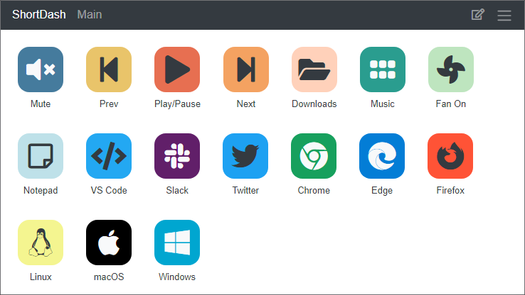

# ShortDash: Cross-platform Shortcut Dashboard



## Overview

ShortDash allows you to create customizable dashboards of shortcuts and actions that can be executed with a click or tap.  You can turn an old tablet or cell phone into your own personal shortcut dashboard.

A server runs on your local network and allows any device with a web browser to access the dashboards. A cross-platform target application allows actions to be executed on any Windows, Mac or Linux machine.  All controlled from a single ShortDash server.  Each device can be individually configured to allow full access or just specific dashboards.

Shortcuts can be created by customizing existing actions to execute programs, web requests, etc.  Multiple actions can be executed with a single shortcut to create advanced workflows.  An open plugin architecture allows anyone to quickly create new actions to fit any workflow required.

## Table of Contents

* [Software Stack](#software-stack)
* [Building](#building)
* [Security](#security)
* [Additional Documentation](#additional-documentation)

## Software Stack

ShortDash was written using the following software stack:

* [ASP.NET Core](https://dotnet.microsoft.com/learn/aspnet/what-is-aspnet-core)
* [Blazor](https://dotnet.microsoft.com/apps/aspnet/web-apps/blazor)
* [Blazored Modal](https://github.com/Blazored/Modal)
* [Blazored Toast](https://github.com/Blazored/Toast)
* [Bootstrap](https://getbootstrap.com/)
* [Entity Framework Core](https://docs.microsoft.com/en-us/ef/core/)
* [Font-Awesome](https://fontawesome.com/)
* [Forge](https://github.com/digitalbazaar/forge)
* [Otp.NET](https://github.com/kspearrin/Otp.NET)
* [QRCode.js](https://github.com/davidshimjs/qrcodejs)
* [UA Parser](https://github.com/ua-parser/uap-csharp)

## Build and Execute

### ShortDash Server

```bash
dotnet build
dotnet run --project ShortDash.Server
```

Open a web browser to the Server URL (Example: `http://hostname:5100`) to begin the setup process.

### ShortDash Target

Update ShortDash.Target/appsettings.json to specify the `ServerUrl` (Example: `http://hostname:5100`).

```bash
dotnet build
dotnet run --project ShortDash.Target
```

Navigate to `http://localhost:5101` to start the pairing process for the target.

## Security

ShortDash is intended to run on a personal network and is not intended to be exposed to the internet.

Since installing and trusting self-signed certificates on a local network is not a user-friendly process, HTTPS is not used.  To protect the connections and sensitive data transmitted between the ShortDash server, devices and targets, a secure communications channel is established using RSA public/private certificates and AES-256 encryption.  All sensitive information and actions are transmitted over this secure communications channel and the identity of the sender is verified before every action is performed.

All sensitive information in the database is stored using AES-256 encryption and data is signed and verified using HMAC-SHA256 signatures to prevent tampering.

## Additional Documentation

* [Running as a service](docs/service.md)
