# Quick Start

## Installation

The latest installation files can be obtained from: [https://github.com/CodePenguin/shortdash/releases/latest](https://github.com/CodePenguin/shortdash/releases/latest)

### Windows

* Download the latest Windows x64 installation program: [ShortDash-win-x64-setup.exe](https://github.com/CodePenguin/shortdash/releases/latest/download/ShortDash-win-x64-setup.exe)
* Run the installer EXE.
* Accept all the defaults to install the ShortDash Server and finish the installer.
* The ShortDash logo will appear in the System Tray near the Clock.
* Click the logo and select "ShortDash Server" from the menu.
* The ShortDash website will be launched using your default browser.
* Follow the steps in the [Setup](#setup) section below.

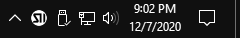

### Mac OSX

* Download the latest Mac OSX DMG: [ShortDash-osx-x64.dmg](https://github.com/CodePenguin/shortdash/releases/latest/download/ShortDash-osx-x64.dmg)
* Open the DMG file.
* Drag "ShortDash Server" application to the "Applications" folder.
* Double click the "Applications" folder.
* Right click on the "ShortDash Server" application.
* Click the "Open" menu item.
A dialog will be displayed asking if you are sure you want to open "ShortDash Server". (Note: This will only happen the first time you open the application after installation.)
* Click the "Open" button.
* The ShortDash logo will appear in the Menu Bar.
* Click the logo and select "ShortDash Server" from the menu.
* The ShortDash website will be launched using your default browser.
* Follow the steps in the [Setup](#setup) section below.

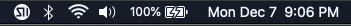

### Linux (Debian/Ubuntu)

* Download the latest Linux x64 Debian package: [ShortDash-Server-linux-x64.deb](https://github.com/CodePenguin/shortdash/releases/latest/download/ShortDash-Server-linux-x64.deb)
* Open the DEB file and click "Install" or execute `sudo dkpg -i ShortDash-Server-linux-x64.deb` from the command line.
* Click the "Show Applications" button.
* Click on "ShortDash Server".
* The ShortDash logo will appear in the Menu Bar.
* Click the logo and select "ShortDash Server" from the menu.
* The ShortDash website will be launched using your default browser.
* Follow the steps in the [Setup](#setup) section below.

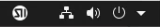

## Initial Setup

The first time ShortDash is accessed, you will be prompted to store your Full Access Device code.  It is important to store this somewhere safe as it will not be displayed again and will be needed for full access and recovery in the future.  

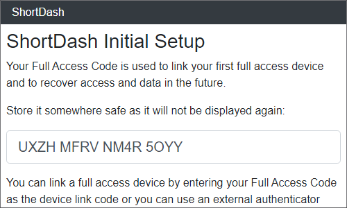
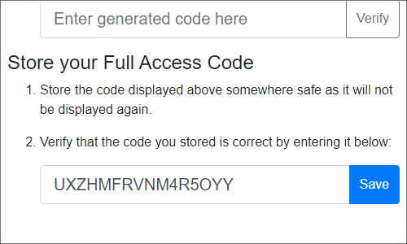
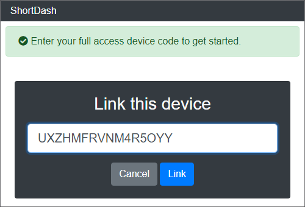

## Creating an action

To create an action you can use the link on the home screen or use the "Actions" menu from the menu button in the top right corner.

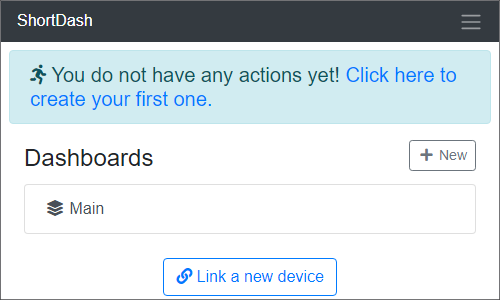

Select any Action Type from the installed plugins.  For this example, we will use the "Execute Process" action which can open programs or websites.  The Target lets you indicate where the action will be executed.  The default is the "ShortDash Server".  Additional Targets can be configured later.

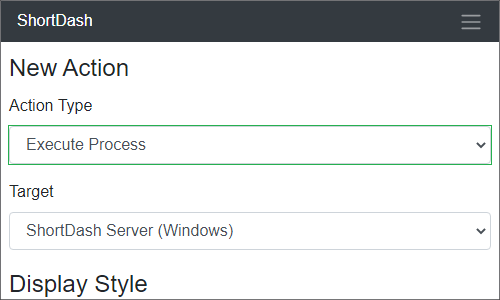

Display Styles allow you to customize how the shortcut will appear on the dashboards.  If an icon is not displayed, the Label will used as the button contents.

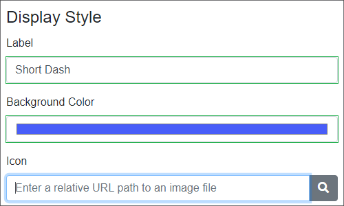

Each action can have various parameters for configuring how the action will be executed.  In this example, we want the shortcut to open the ShortDash GitHub page in the default browser so the URL is entered in for the "File Name".

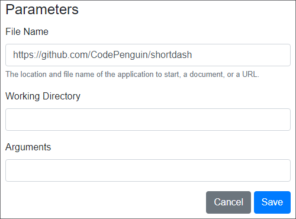

Once the action is created, you can use the Menu button to go to the Main dashboard.  A single action can be added to multiple dashboards.

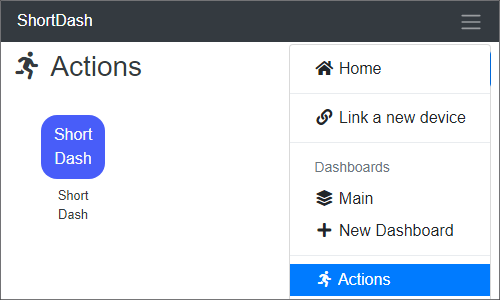

## Add an action to a dashboard

Empty dashboards will automatically be displayed in edit mode.  Or you can click the "Edit" button in the top right corner to enter edit mode. Pressing the "+" button will open the "Add Actions" dialog.

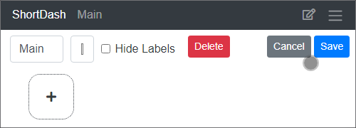

You can add multiple actions to a dashoard at the same time.

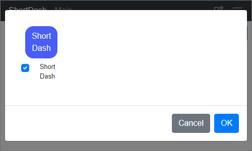

Use the arrows to reorganize the action shortcuts on the dashboard to your liking.  The dashboard display will automatically adjust to the screen size of the device so shortcuts will be fill in the available space from top left to bottom right.

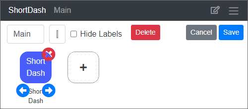

Once the actions have been added to the dashboard and organized, click the "Save" button to leave edit mode.  If you click the "Short Dash" shortcut icon, the ShortDash GitHub page will be opened in your default web browser.

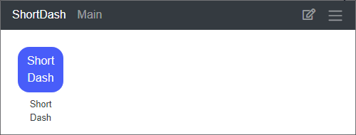

## Linking a new device

ShortDash can be accessed from any desktop, laptop or mobile device that has a modern web browser.  From the Home screen, click the "Link a new device" button or use the menu button in the top right corner and click "Link a new device."

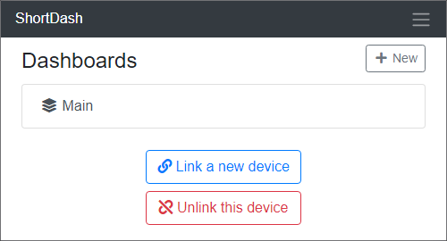
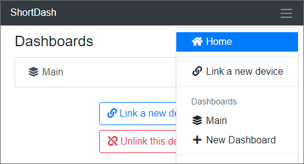

Each device can be given customized permissions to access ShortDash.  You can edit the device permissions later if needed.  Select the desired permission and then click "Link" to start the linking process.

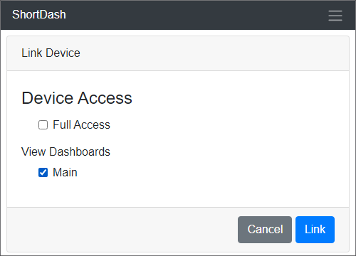

Use the left and right arrows to cycle through the available URLs for the server if applicable.  

Using the new device, scan the QR code to open provided URL and the device will automatically be linked.  Alternately, you can manually type the displayed in the device's web browser and then type the six digit link code into the web browser and click "Link".

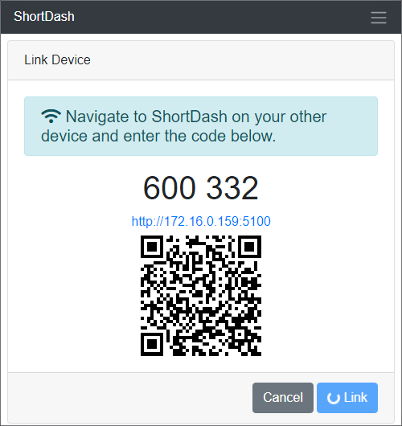

Once the device has been linked, you can modify the Name as desired.

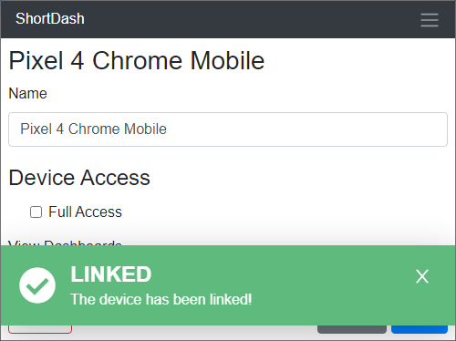